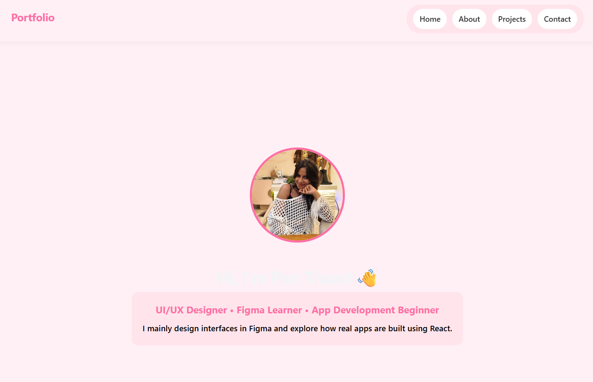
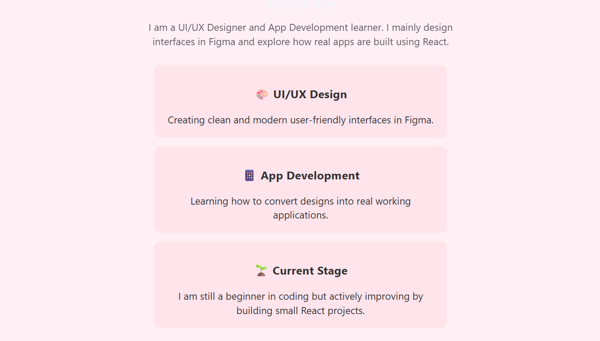
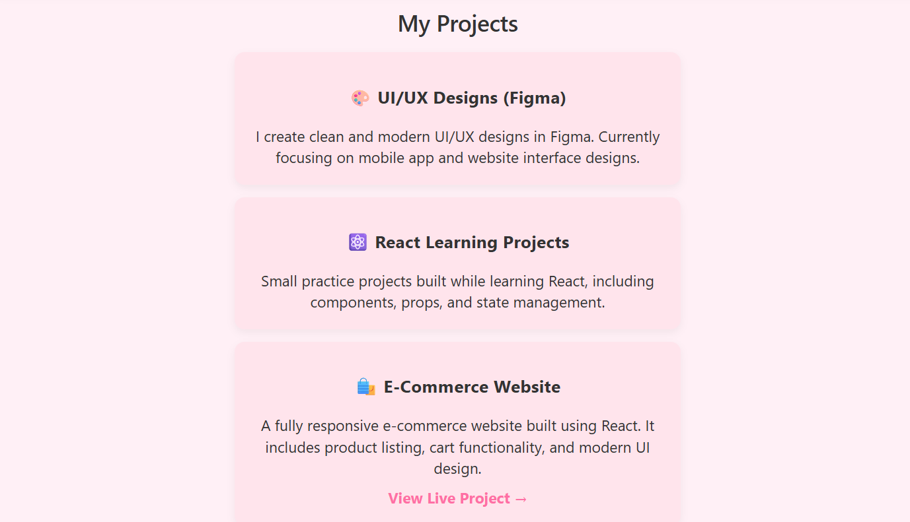
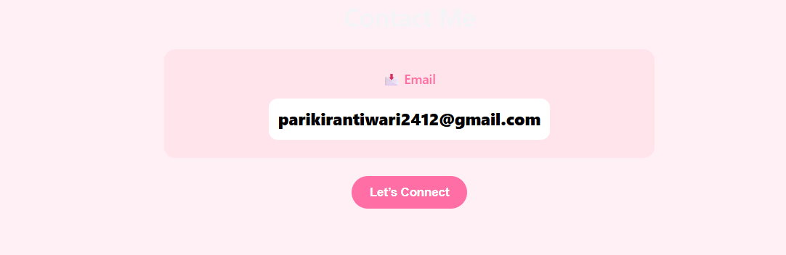

# 🌸 Pari Tiwari - Portfolio

This is my personal portfolio website built using **React + Vite**.

---

## 💖 About Me

I am a UI/UX Designer and App Development learner.  
I mainly design interfaces in Figma and explore how real apps are built using React.

---

## 🎨 Skills

- UI/UX Design (Figma)
- React Basics
- Frontend Development (Learning Stage)

---

## 🛍️ Projects

- UI/UX Design Practice (Figma)
- React Portfolio Website
- E-Commerce Website (Live Project)

---

## 📸 Portfolio Screenshots

### 🖥️ Home Page

---

### 🎨 About Section

---

### 🛍️ Projects Section

---

### 📩 Contact Section

---

## 📩 Contact

📧 Email: **parikirantiwari2412@gmail.com**

---

## ⭐ Note

This project is created while learning UI/UX design and React development.